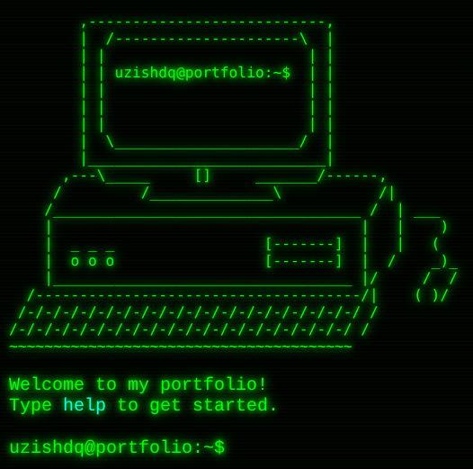

# 🖥️ Retro Terminal Portfolio

Welcome to my **Retro Terminal Portfolio** — a unique, command-line inspired personal website that runs entirely in your browser.  
Type commands, explore my projects, and feel like you're inside a vintage terminal.



---

## ✨ Features

- **ASCII Art Intro** — A retro animated welcome screen.
- **Command Autocomplete** — Just like a real shell, press `TAB` to complete commands.
- **Custom Commands**
  - `help` — See all available commands.
  - `home` — Return to the home screen.
  - `about` — Learn more about me.
  - `experience` — Work history & achievements.
  - `projects` — Auto-fetch my GitHub repositories.
  - `contact` — Get in touch.
- **Fully Responsive** — Works on desktop & mobile.
- **No External Assets** — Lightweight and fast.

---

## 🚀 Demo

Live demo: [**Click here**](https://uzishdq.github.io/portofolio/)

---

## 📂 How to Use Locally

```bash
# Clone this repository
git clone https://github.com/uzishdq/portofolio.git

# Open in your browser
open index.html
```
